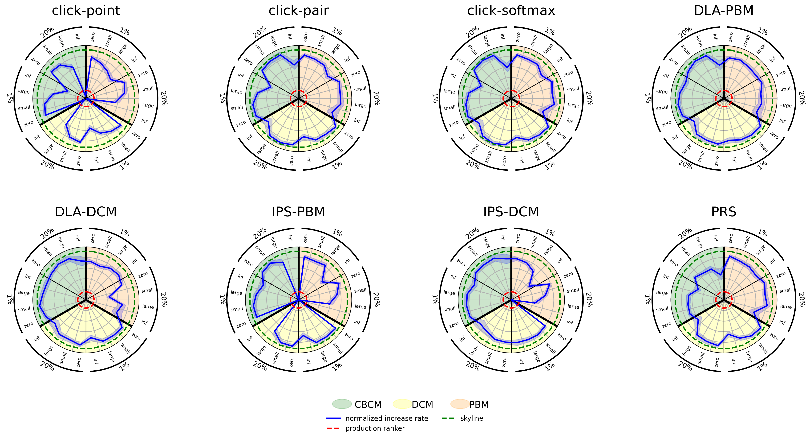
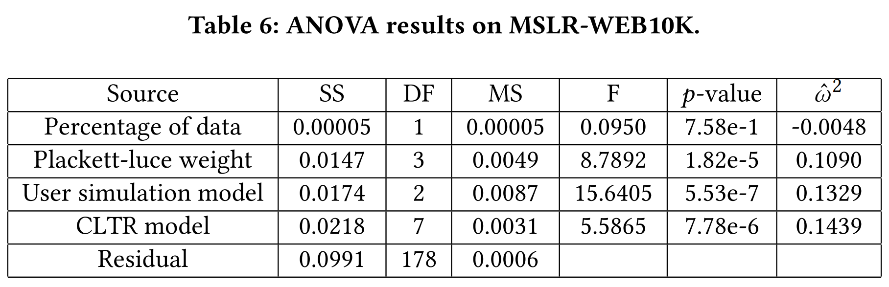
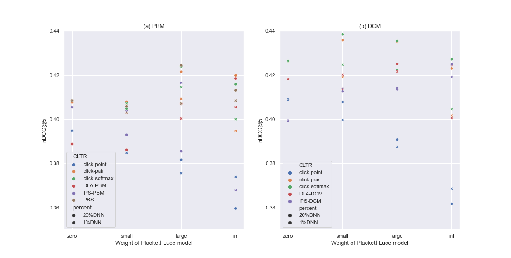
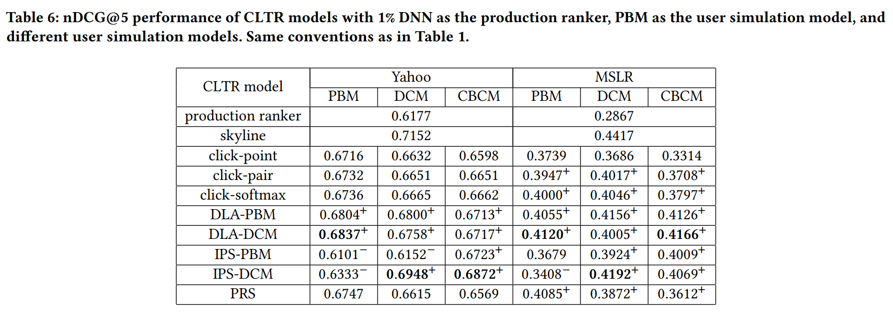

# Investigating the Robustness of Counterfactual Learning to Rank Models

This repository contains the online appendix and supporting code for our paper "Investigating the Robustness of Counterfactual Learning to Rank Models".

## Online Appendix

[comment]: <> (### The spider chart on MSLR)

[comment]: <> (![image]&#40;https://anonymous.4open.science/r/Investigating-the-Robustness-of-Counterfactual-Learning-to-Rank-Models-BF74/experimental_results_on_MSLR/MSLR_spider_chart.png&#41;)

[comment]: <> (### The ANOVA results on MSLR)

[comment]: <> (![image]&#40;https://anonymous.4open.science/r/Investigating-the-Robustness-of-Counterfactual-Learning-to-Rank-Models-BF74/experimental_results_on_MSLR/MSLR_ANOVA_results.png&#41;)

[comment]: <> (### The effect of production ranker on CLTR models on MSLR)

[comment]: <> (![image]&#40;https://anonymous.4open.science/r/Investigating-the-Robustness-of-Counterfactual-Learning-to-Rank-Models-BF74/experimental_results_on_MSLR/MSLR_effect_of_production_ranker.png&#41;)

[comment]: <> (### The effect of user simulation model on CLTR models on MSLR)

[comment]: <> (![image]&#40;https://anonymous.4open.science/r/Investigating-the-Robustness-of-Counterfactual-Learning-to-Rank-Models-BF74/experimental_results_on_MSLR/MSLR_effect_of_user_simulation_model.png&#41;)
### The spider chart on MSLR


### The ANOVA results on MSLR


### The effect of production ranker on CLTR models on MSLR


### The effect of user simulation model on CLTR models on MSLR


## Repository Usage
### Get Started
```
pip install -r requirements.txt
```

### To preprocess data
To normalize the features:
```
python extrac_feature_statistics.py [DATASET_PATH]
python normaliza_feature.py [FEATEURE_STATISTIC_FILE] [DATA_PATH] [OUTPUT_PATH] ["log"(optional)]
```

To convert the data to ULTRA form:
```
python convert_to_ULTRA.py [DATA_PATH] [feature_lenth] [OUTPUT_PATH]
```

### To generate click data for initial ranking lists
```
python generate_PBM.py [INITLIST_PATH] [eta] [ULTRA_DATA_PATH]
python generate_DCM.py [INITLIST_PATH] [beta] [eta] [ULTRA_DATA_PATH]
python generate_CBCM.py [INITLIST_PATH] [w] [g] [eta] [ULTRA_DATA_PATH]
```

### To train and evaluate CLTR models
This project reproduces the counterfactual learning to rank models based on [ULTRA_pytorch](https://github.com/ULTR-Community/ULTRA_pytorch). Here we give the simple instructions to train a CLTR model. Please see [ULTRA_pytorch](https://github.com/ULTR-Community/ULTRA_pytorch) for more details about this framework.

For example, to train a DLA-PBM model:
```
python main.py --CLTR_model DLA_PBM --data_dir ./tests/data/ --train_data_prefix train --model_dir ./tests/model/DLAPBM_256_0.1 --setting_file ./tests/test_settings/dla.json --batch_size 256 --ln 0.1 --seed 1 --max_train_iteration 10000
```
To evaluate a CLTR model:
```
python main.py --data_dir ./tests/data/ --setting_file ./tests/test_settings/dla.json --batch_size 256 --test_only True  --model_dir ./tests/data/model/DLAPBM_256_0.1/ultra.learning_algorithm.DLA.ckpt200
```